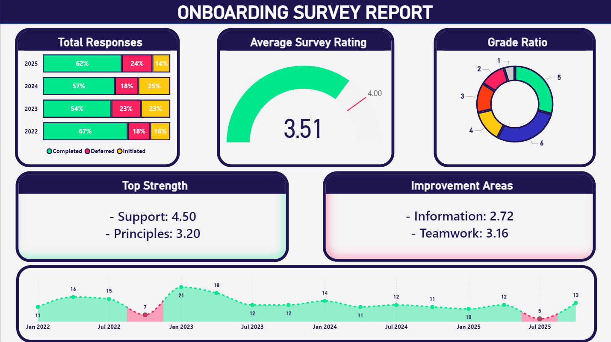
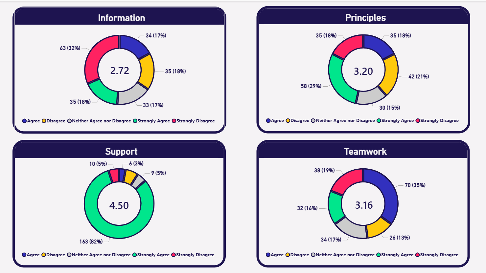
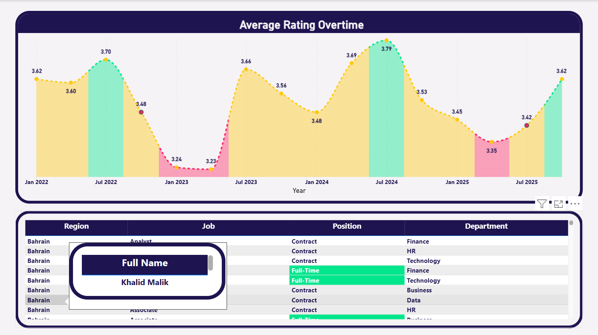

# Employee Onboarding Feedback Analytics Dashboard

## Overview

This project analyzes employee onboarding feedback to evaluate the effectiveness of the company’s onboarding program and identify areas for improvement.

The dashboard transforms raw survey responses into structured insights that help HR teams understand how new employees experience the onboarding process across departments, job grades, and time periods.

By automating survey analysis and visualization, the project replaces manual reporting with a scalable analytics solution that enables continuous monitoring of onboarding performance.

---

## Overall Rating


## Individual Ratings


## Ratings Overtime


---

# Core Purpose

Automates onboarding survey analysis to replace manual processing of employee feedback data.

Transforms survey responses into measurable onboarding performance indicators.

Provides HR teams with data-driven insights to continuously improve the new hire experience and strengthen employee retention.

---

# Key Features

## Response Rate Monitoring

Tracks employee survey participation across different statuses:

* Completed surveys
* Deferred responses
* Initiated surveys

This helps HR monitor engagement levels and identify gaps in feedback collection.

---

## Multi-Dimensional Feedback Analysis

The dashboard evaluates four critical pillars of onboarding:

**Information**
Measures how clearly new employees receive information about their role, responsibilities, and company processes.

**Support**
Evaluates the level of support provided by managers and colleagues during onboarding.

**Principles**
Assesses alignment between employee expectations and organizational values.

**Teamwork**
Measures how effectively new hires integrate into their teams.

---

## Temporal Trend Analysis

Survey results are analyzed across multiple years to track changes in onboarding experience over time.

The dashboard visualizes trends from:

* 2022
* 2023
* 2024
* 2025

This helps HR understand whether onboarding initiatives are improving employee satisfaction.

---

## Departmental & Role-Based Insights

The analysis compares onboarding feedback across departments including:

* Finance
* HR
* Technology
* Business
* Data

Additional segmentation is available by:

* Job position
* Grade level
* Region
* Business unit

This enables targeted improvements within specific teams.

---

# User Benefits

## Eliminates Manual Reporting

Automates the collection, aggregation, and visualization of onboarding survey responses.

This significantly reduces the time HR teams spend on manual data processing and reporting.

---

## Identifies Strengths and Improvement Areas

The dashboard highlights top-performing onboarding elements as well as areas requiring improvement.

For example:

* Strong managerial support scores
* Lower information clarity scores

These insights guide HR in prioritizing improvements.

---

## Supports Strategic HR Planning

Provides leadership with actionable insights to:

* Improve onboarding processes
* Allocate HR resources more effectively
* Enhance new hire engagement
* Reduce early-stage employee attrition

---

## Enhances Organizational Transparency

Managers gain clear visibility into how their departments perform in onboarding satisfaction.

This encourages accountability and continuous improvement.

---

# Technical Implementation

## Data Processing

The project uses automated data preparation techniques to transform raw survey data into analysis-ready datasets.

This includes:

* Data cleaning
* Standardizing survey response formats
* Converting textual responses into numeric scores
* Structuring data for Power BI reporting

---

## Data Model

The dataset contains key attributes such as:

* Employee name
* Department
* Region
* Business unit
* Job position
* Grade
* Survey response status
* Year of survey response

These fields allow flexible filtering and segmentation within the dashboard.

---

## Key DAX Measures

### Average Survey Rating

Calculates the average onboarding rating across the four survey pillars while ignoring blank or zero values.

```DAX
AverageSurveyRatingOutof5_NoZeros =
AVERAGEX(
    'Sheet1',
    VAR V1 = [Information (number)]
    VAR V2 = [Support (number)]
    VAR V3 = [Principles (number)]
    VAR V4 = [Teamwork (number)]

    VAR AllValues = {V1, V2, V3, V4}

    VAR FilteredValues =
        FILTER(AllValues, NOT(ISBLANK([Value])) && [Value] <> 0)

    RETURN
        AVERAGEX(FilteredValues, [Value])
) + 0.12
```

This measure ensures accurate average scores by excluding missing values.

---

### Top Performing Survey Metrics

Identifies the highest-rated onboarding pillars.

```DAX
TopScore =
VAR Scores =
    UNION(
        ROW("Metric","Information","Score",AVERAGE('Sheet1'[Information (number)])),
        ROW("Metric","Teamwork","Score",AVERAGE('Sheet1'[Teamwork (number)])),
        ROW("Metric","Principles","Score",AVERAGE('Sheet1'[Principles (number)])),
        ROW("Metric","Support","Score",AVERAGE('Sheet1'[Support (number)]))
    )

VAR Top3 =
    TOPN(2,Scores,[Score],DESC)

RETURN
CONCATENATEX(
    Top3,
    "- " & [Metric] & ": " & FORMAT([Score],"0.00"),
    UNICHAR(10),
    [Score],
    DESC
)
```

---

### Lowest Performing Survey Metrics

Highlights onboarding areas that require improvement.

```DAX
BottomScore =
VAR Scores =
    UNION(
        ROW("Metric","Information","Score",AVERAGE('Sheet1'[Information (number)])),
        ROW("Metric","Teamwork","Score",AVERAGE('Sheet1'[Teamwork (number)])),
        ROW("Metric","Principles","Score",AVERAGE('Sheet1'[Principles (number)])),
        ROW("Metric","Support","Score",AVERAGE('Sheet1'[Support (number)]))
    )

VAR Bottom =
    TOPN(2,Scores,[Score],ASC)

RETURN
CONCATENATEX(
    Bottom,
    "- " & [Metric] & ": " & FORMAT([Score],"0.00"),
    UNICHAR(10),
    [Score],
    ASC
)
```

---

# Visualization Features

The Power BI dashboard includes:

* KPI cards summarizing average survey ratings
* Trend analysis charts showing feedback evolution
* Department comparison visuals
* Survey status distribution charts
* Interactive slicers for filtering by:

  * Year
  * Department
  * Job position
  * Region
  * Business unit

These visualizations enable intuitive exploration of onboarding data.

---

# Data Privacy

The project uses **synthetic/dummy data** to demonstrate the analytical framework.

The structure is designed to support secure integration with real HR data while maintaining compliance with data privacy standards.

---

# Conclusion

This project demonstrates how employee onboarding feedback can be transformed into meaningful analytics that drive organizational improvement.

By combining automated data preparation, advanced DAX calculations, and interactive dashboards, the solution provides HR leaders with a powerful tool for monitoring onboarding effectiveness and improving employee experience.

---
